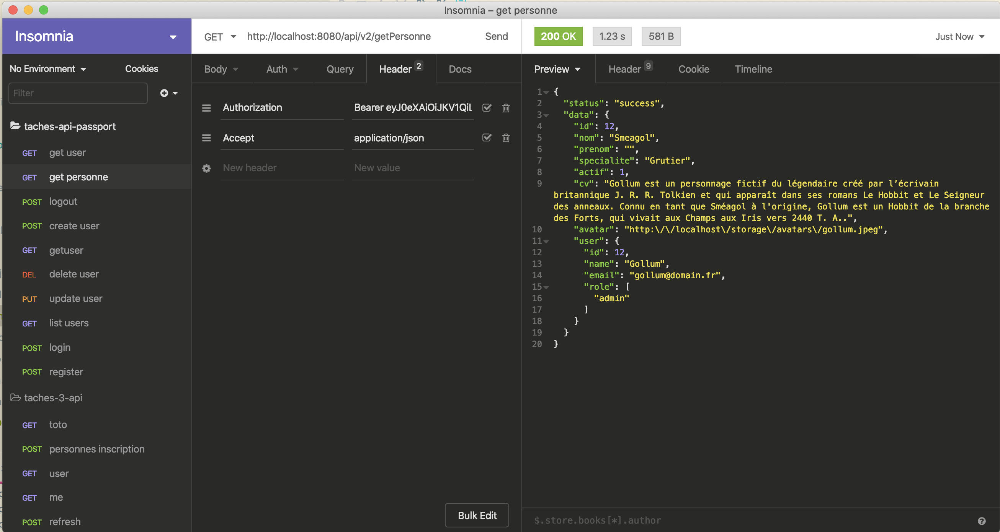

# Utilisation de docker pour notre projet

Voici la version de docker et de docker-compose qui a été utilisée pour ce tutoriel :


Pour installer docker sur votre machine voir la documentation [pour linux](https://docs.docker.com/install/linux/docker-ce/ubuntu/), pour [windows](https://docs.docker.com/docker-for-windows/install/) et [pour mac](https://docs.docker.com/docker-for-mac/install/).
Pour installer `docker-compose` sur votre machine voir la documentation [pour linux](https://docs.docker.com/compose/install/), pour windows(pas testé) et mac `docker-compose` doit déjà être installé.

## Architecture de notre projet

Dans le fichier docker-compose.yml on trouvera l'architecture du projet qui comprend :

-   Un conteneur qui exécute un serveur web (**webserver**) qui traite les requêtes html
-   Un conteneur qui exécute du code php (**app**)
-   Un conteneur qui contient un serveur de gestion de base de données (**db**)

Ces trois conteneurs travaillent sur un réseaux (**back-end**) et les données de la base de données dans un volume (**dbdata**)

## Création des images et création des conteneurs

````bash
docker-compose build
````

puis 

````bash
docker-compose up -d
````

La commande `docker ps` doit vous retourner le résultat suivant :

````bash
docker ps
CONTAINER ID        IMAGE                     COMMAND                  CREATED              STATUS              PORTS                                        NAMES
ba3084af6fcc        nginx:alpine              "nginx -g 'daemon of…"   About a minute ago   Up About a minute   0.0.0.0:443->443/tcp, 0.0.0.0:8080->80/tcp   webserver
0afa59a4ef7b        mariadb                   "docker-entrypoint.s…"   About a minute ago   Up About a minute   0.0.0.0:8306->3306/tcp                       db
10d6b3d00e95        taches-api-passport_app   "docker-php-entrypoi…"   About a minute ago   Up About a minute   9000/tcp                                     app
````

## Configuration de votre application pour docker

### Génération de la clé laravel

```bash
docker-compose exec app php artisan key:generate
Application key set successfully.
```

### Création du cache

```bash
 docker-compose exec app php artisan config:cache
Configuration cache cleared!
Configuration cached successfully!
```

### Connexion et initialisation des tables de la base de données

Le contenu du fichier `.env` et notamment les informations de connexion avec la base de données doivent être en accord.

voici les informations de connexion que nous allons utiliser :

```bash
DB_CONNECTION=mysql
DB_HOST=db
DB_PORT=3306
DB_DATABASE=taches_api
DB_USERNAME=the_admin
DB_PASSWORD=secret
```

et voici les informations données dans le fichier docker-compose.yml

```bash
MYSQL_DATABASE: taches_api
MYSQL_ROOT_PASSWORD: secret
SERVICE_TAGS: dev
SERVICE_NAME: mysql
```

Il faut donc créer un utilisateur the_admin avec le mot de passe secret sur le serveur de base de données. Pour cela nous allons nous connecter
sur le serveur de base de données et ajouter l'utilisateur.


```bash
docker-compose exec db bash
root@0afa59a4ef7b:/# mysql -u root -p
Enter password: 
Welcome to the MariaDB monitor.  Commands end with ; or \g.
Your MariaDB connection id is 8
Server version: 10.4.12-MariaDB-1:10.4.12+maria~bionic-log mariadb.org binary distribution

Copyright (c) 2000, 2018, Oracle, MariaDB Corporation Ab and others.

Type 'help;' or '\h' for help. Type '\c' to clear the current input statement.

MariaDB [(none)]> show databases;
+--------------------+
| Database           |
+--------------------+
| information_schema |
| mysql              |
| performance_schema |
| taches_api         |
+--------------------+
4 rows in set (0.001 sec)

MariaDB [(none)]> GRANT ALL ON taches_api.* TO 'the_admin'@'%' IDENTIFIED BY 'secret';
Query OK, 0 rows affected (0.003 sec)
```

### Création des bases de données

Nous allons utiliser le mécanisme de migration des tables proposé par laravel.

1.  Migration de la base de données
    ```bash
     docker-compose exec app php artisan migrate
    Migration table created successfully.
    Migrating: 2014_10_12_000000_create_users_table
    Migrated:  2014_10_12_000000_create_users_table (0.03 seconds)
    Migrating: 2014_10_12_100000_create_password_resets_table
    Migrated:  2014_10_12_100000_create_password_resets_table (0.01 seconds)
    Migrating: 2016_06_01_000001_create_oauth_auth_codes_table
    Migrated:  2016_06_01_000001_create_oauth_auth_codes_table (0.03 seconds)
    Migrating: 2016_06_01_000002_create_oauth_access_tokens_table
    Migrated:  2016_06_01_000002_create_oauth_access_tokens_table (0.03 seconds)
    Migrating: 2016_06_01_000003_create_oauth_refresh_tokens_table
    Migrated:  2016_06_01_000003_create_oauth_refresh_tokens_table (0.02 seconds)
    Migrating: 2016_06_01_000004_create_oauth_clients_table
    Migrated:  2016_06_01_000004_create_oauth_clients_table (0.02 seconds)
    Migrating: 2016_06_01_000005_create_oauth_personal_access_clients_table
    Migrated:  2016_06_01_000005_create_oauth_personal_access_clients_table (0.01 seconds)
    Migrating: 2019_08_19_000000_create_failed_jobs_table
    Migrated:  2019_08_19_000000_create_failed_jobs_table (0.01 seconds)
    Migrating: 2020_01_25_220942_create-tache-table
    Migrated:  2020_01_25_220942_create-tache-table (0.01 seconds)
    Migrating: 2020_01_25_221157_create-personne-table
    Migrated:  2020_01_25_221157_create-personne-table (0.03 seconds)
    Migrating: 2020_01_25_222325_create-suivi-table
    Migrated:  2020_01_25_222325_create-suivi-table (0.05 seconds)
    Migrating: 2020_01_25_223905_create-personne-tache-table
    Migrated:  2020_01_25_223905_create-personne-tache-table (0.05 seconds)
    Migrating: 2020_03_03_093355_create_roles_table
    Migrated:  2020_03_03_093355_create_roles_table (0.02 seconds)
    ``` 

1.  Test de la connexion avec la base de données

    ```bash
    hemery@leni-150-226 taches-api-passport % docker-compose exec app php artisan tinker
    Psy Shell v0.9.12 (PHP 7.3.14 — cli) by Justin Hileman
    >>> \DB::table('migrations')->get();
    => Illuminate\Support\Collection {#3068
         all: [
           {#3066
             +"id": 1,
             +"migration": "2014_10_12_000000_create_users_table",
             +"batch": 1,
           },
           {#3075
             +"id": 2,
             +"migration": "2014_10_12_100000_create_password_resets_table",
             +"batch": 1,
           },
           {#3076
             +"id": 3,
             +"migration": "2016_06_01_000001_create_oauth_auth_codes_table",
             +"batch": 1,
           },
           {#3077
             +"id": 4,
             +"migration": "2016_06_01_000002_create_oauth_access_tokens_table",
             +"batch": 1,
           },
           {#3078
             +"id": 5,
             +"migration": "2016_06_01_000003_create_oauth_refresh_tokens_table",
             +"batch": 1,
           },
           {#3079
             +"id": 6,
             +"migration": "2016_06_01_000004_create_oauth_clients_table",
             +"batch": 1,
           },
           {#3080
             +"id": 7,
             +"migration": "2016_06_01_000005_create_oauth_personal_access_clients_table",
             +"batch": 1,
           },
           {#3081
             +"id": 8,
             +"migration": "2019_08_19_000000_create_failed_jobs_table",
             +"batch": 1,
           },
           {#3082
             +"id": 9,
             +"migration": "2020_01_25_220942_create-tache-table",
             +"batch": 1,
           },
           {#3083
             +"id": 10,
             +"migration": "2020_01_25_221157_create-personne-table",
             +"batch": 1,
           },
           {#3084
             +"id": 11,
             +"migration": "2020_01_25_222325_create-suivi-table",
             +"batch": 1,
           },
           {#3085
             +"id": 12,
             +"migration": "2020_01_25_223905_create-personne-tache-table",
             +"batch": 1,
           },
           {#3086
             +"id": 13,
             +"migration": "2020_03_03_093355_create_roles_table",
             +"batch": 1,
           },
         ],
       }
    >>> ^D
    Exit:  Ctrl+D
    ```
    
1.  Clé pour passport    

    ```bash
    hemery@leni-150-226 taches-api-passport % docker-compose exec app php artisan passport:install
    Encryption keys already exist. Use the --force option to overwrite them.
    Personal access client created successfully.
    Client ID: 1
    Client secret: D7SrcQgVYcqEf18YcPc0bj5G16I52vpbv4QXz0oc
    Password grant client created successfully.
    Client ID: 2
    Client secret: FBBZKtcoa9jtyahOHNCEA1p494B8wffbhFLlZdpD
    ``` 

```bash
hemery@leni-150-226 taches-api-passport % docker-compose exec app php artisan db:seed         
Seeding: PersonneTableSeeder
Seeded:  PersonneTableSeeder (0.38 seconds)
Seeding: TacheTableSeeder
Seeded:  TacheTableSeeder (0.04 seconds)
Seeding: PersonneTacheTableSeeder
Seeded:  PersonneTacheTableSeeder (0.06 seconds)
Seeding: SuiviTableSeeder
Seeded:  SuiviTableSeeder (0.36 seconds)
Database seeding completed successfully.
```

### Tester l'application

*   Taper l'url `http://localhost:8080/` pour obtenir cela à l'écran :


En utilisant [Insomnia](https://insomnia.rest/changelog/7.1.1/)

*   Ecran de connexion

    

*   Liste des Users

    On copie la valeur du jeton dans l'en-tête de la requête
    
    
   
*   Informations sur l'utilisateur connectée :
    
    
   
