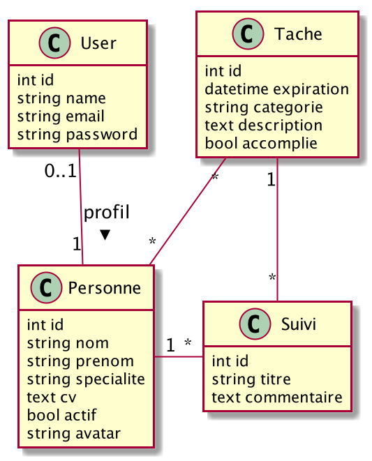

<p align="center"></p>


## Présentation de ce projet

Version API de l'application taches que nous avons utilisé pendant les séances de TP du module Pweb-1.

## Rappels sur le système d'information utilisé

*   Une tâche est caractérisée par 

    -   Une date d'expiration
    -   Une catégorie
    -   Une description
    -   Un boolean accomplie

*   Une personne est caractérisée par 

    -   Un nom
    -   Un prénom
    -   Une spécialité
    -   Un avatar
    -   Un CV
    -   un booléen qui indique si la personne est active ou non

*   Un suivi d'activité est caractérisé par 

    -   Un titre
    -   Un commentaire

*   Un `User` est la classe proposée par `Laravel` pour mettre en oeuvre l'identification.

* Quelques explications sur les relations entre classes :

    -   Une tâche est accomplie par plusieurs personnes.
    -   Un suivi d'exécution est associé à une tâche et une tâche peut faire l'objet de plusieurs suivis d'exécution
    -   Une personne peut se connecté si un enregistrement dans la table user est associé avec la personne
    -   Un suivi d'exécution est créé par une personne



### La création du système d'information

Pour créer le système d'information, nous allons utiliser le mécanisme de migration proposé par `Laravel`.

Pour cela nous devons créer :

1.  Les fichiers de migration dans le répertoire `database/migrations`.
1.  Les fichiers de fabrication des enregistrements de chaque table dans le répertoire `database/factories`.
1.  Les fichiers d'insertion des données dans chaque table dans le répertoire `database/seeds`.

Pour faire le lien entre notre application et le système de gestion de base de données, il faut modifier le fichier `.env` 
en indiquant les bonnes valeurs aux variables suivantes :

```
DB_CONNECTION=mysql
DB_HOST=127.0.0.1
DB_PORT=3306
DB_DATABASE=nomDeLaBase
DB_USERNAME=NomDeUser
DB_PASSWORD=MDP
```

Il faut ensuite exécuter les commandes suivantes :

```bash
php artisan migrate:fresh
php artisan db:seed   
```

## Modification pour stockage des images 

1.  Création du lien pour accès au répertoire public

    ```bash
    php artisan storage:link
    ```
    
1.  Modification du lieu de stockage par défaut dans le fichier `config/filesystem.php`
    Ici on remplace `local` avec `public` pour pouvoir stocker les avatars.

    ```php
    'default' => env('FILESYSTEM_DRIVER', 'public'),
    ```
        

## Mise en oeuvre de l'authentification

Nous allons utiliser un package supplémentaire : [`passport`](https://github.com/tymondesigns/jwt-auth/tree/develop).

Pour configurer notre application Laravel, nous allons suivre le tutoriel [Building an API in Laravel with Passport](https://medium.com/swlh/building-an-api-in-laravel-with-passport-bd17cf39109f).

*   Pour installer la librairie

    ```bash
    composer require laravel/passport
    ```

*   Pour créer les tables nécessaires à passport

    ```bash
    php artisan migrate
    ```

*   Pour initialiser la clé de passport pour le cryptage

    ```bash
    php artisan passport:install
    ```

*   Utilisation du trait `HasApiTokens` dans la classe `User`

    ```php
    <?php
    
    namespace App;
    
    use App\Model\Personne;
    use App\Model\Role;
    use Illuminate\Contracts\Auth\MustVerifyEmail;
    use Illuminate\Foundation\Auth\User as Authenticatable;
    use Illuminate\Notifications\Notifiable;
    use Laravel\Passport\HasApiTokens;
    
    class User extends Authenticatable
    {
        use HasApiTokens, Notifiable;
    
        /**
         * The attributes that are mass assignable.
         *
         * @var array
         */
        protected $fillable = [
            'name', 'email', 'password',
        ];
    
        /**
         * The attributes that should be hidden for arrays.
         *
         * @var array
         */
        protected $hidden = [
            'password', 'remember_token',
        ];
    
        /**
         * The attributes that should be cast to native types.
         *
         * @var array
         */
        protected $casts = [
            'email_verified_at' => 'datetime',
        ];
    
        function role() {
            return $this->hasMany(Role::class);
        }
    
    
        public function personne() {
            return $this->hasOne(Personne::class);
        }
    
    }
    ```

*   Ajout des routes pour gérer le protocole OAuth 2.0

    ```php
    <?php
    
    namespace App\Providers;
    
    use Illuminate\Foundation\Support\Providers\AuthServiceProvider as ServiceProvider;
    use Illuminate\Support\Facades\Gate;
    use Laravel\Passport\Passport;
    
    class AuthServiceProvider extends ServiceProvider
    {
        /**
         * The policy mappings for the application.
         *
         * @var array
         */
        protected $policies = [
            // 'App\Model' => 'App\Policies\ModelPolicy',
        ];
    
        /**
         * Register any authentication / authorization services.
         *
         * @return void
         */
        public function boot()
        {
            $this->registerPolicies();
            Passport::routes();
        }
    }
    ```
    
*   Modification du fichier de configuration de l'authentification config/auth.php

    ```php
    // ...
    'guards' => [
        'web' => [
            'driver' => 'session',
            'provider' => 'users',
        ],

        'api' => [
            'driver' => 'passport',
            'provider' => 'users',
            'hash' => false,
        ],
    ],
    // ...
    ```    
    
*   Standardisation des messages réponses : utilisation de [JSend](https://github.com/omniti-labs/jsend) et d'une implémentation  [shalvah/laravel-jsend](https://github.com/shalvah/laravel-jsend)   

    ```bash
    composer req shalvah/laravel-jsend
    ```

    
*   Création d'un contrôleur d'authentification

    ```bash
    php artisan make:controller Api\\AuthController
    ```
    
    ```php
    <?php
    
    namespace App\Http\Controllers\Api;
    
    use App\Http\Controllers\Controller;
    use App\User;
    use Illuminate\Http\Request;
    use Illuminate\Support\Facades\Auth;
    use Illuminate\Support\Facades\Validator;
    
    class AuthController extends Controller {
        public $successStatus = 200;
    
        public function register(Request $request) {
            $validator = Validator::make($request->all(),
                [
                    'name' => 'required',
                    'email' => 'required|email',
                    'password' => 'required',
                ]);
            if ($validator->fails()) {
                return response()->json(['error' => $validator->errors()], 401);
            }
            $input = $request->all();
            $input['password'] = bcrypt($input['password']);
            $user = User::create($input);
            $success['token'] = $user->createToken('Taches-api')->accessToken;
            return jsend_success($success);
        }
    
    
        public function login() {
            if (Auth::attempt(['email' => request('email'), 'password' => request('password')])) {
                $user = Auth::user();
                $success['token'] = $user->createToken('Taches-api')->accessToken;
                return jsend_success($success);
            } else {
                return jsend_fail([
                    "title" => "Unauthorised",
                    "body" => "Nom d'utilisateur et/ou mot de passe incorrect"
                ], 401);
            }
        }
    
        public function logout(Request $request) {
            if (Auth::check()) {
                $token = Auth::user()->token();
                $token->revoke();
                return jsend_success(['successfully logout'], 201);
            }
            return jsend_fail([
                "title" => "Unauthorised",
                "body" => "Token invalid"
            ], 401);
        }
    
        public function getUser() {
            $user = Auth::user();
            return jsend_success(["user" => $user], 200);
        }
    }
    ```    
    
*   Contenu du fichier routes/api.php

    ```php
    Route::prefix('v2')->group(function () {
        Route::post('login', 'Api\AuthController@login');
        Route::post('register', 'Api\AuthController@register');
    });
    
    Route::prefix('v2')->middleware(['auth:api'])->group(function() {
    
        Route::post('logout', 'Api\AuthController@logout');
    
        Route::get('getUser', 'Api\AuthController@getUser');
        
    });
    ```    

## Mise en oeuvre de la notion de scope

*   Création d'une nouvelle classe middleware

    ```bash
    php artisan make:middleware CheckRole    
    ```
    
    Ce middleware va ajouter le scope de l'utilisateur en fonction de son rôle.
    Avec le contenu suivant :
    
    ```php
    <?php
    
    namespace App\Http\Middleware;
    
    use Closure;
    use Illuminate\Support\Facades\Log;
    
    class CheckRole {
        /**
         * Handle an incoming request.
         *
         * @param \Illuminate\Http\Request $request
         * @param \Closure $next
         * @return mixed
         */
        public function handle($request, Closure $next) {
            $userRole = $request->user()->role()->first();
            if ($userRole) {
                // Set scope as admin/auteur/joueur based on user role
                $request->request->add([
                    'scope' => $userRole->role
                ]);
            }
            return $next($request);
        }
    }   
    ```
    
*   Modification de la liste des middleware dans le fichier `app/Http/Kernel.php`

    ````php
    protected $routeMiddleware = [
        'auth' => \App\Http\Middleware\Authenticate::class,
        'auth.basic' => \Illuminate\Auth\Middleware\AuthenticateWithBasicAuth::class,
        'bindings' => \Illuminate\Routing\Middleware\SubstituteBindings::class,
        'cache.headers' => \Illuminate\Http\Middleware\SetCacheHeaders::class,
        'can' => \Illuminate\Auth\Middleware\Authorize::class,
        'guest' => \App\Http\Middleware\RedirectIfAuthenticated::class,
        'password.confirm' => \Illuminate\Auth\Middleware\RequirePassword::class,
        'signed' => \Illuminate\Routing\Middleware\ValidateSignature::class,
        'throttle' => \Illuminate\Routing\Middleware\ThrottleRequests::class,
        'verified' => \Illuminate\Auth\Middleware\EnsureEmailIsVerified::class,
        'scopes' => \Laravel\Passport\Http\Middleware\CheckScopes::class,
        'scope' => \Laravel\Passport\Http\Middleware\CheckForAnyScope::class,
        'role' => \App\Http\Middleware\CheckRole::class,
    ];
    ````
    
*   Ajout des scopes gérer par l'application dans le fichier `app/Providers/AuthServiceProvider.php`

    ```php
    public function boot() {
        // ...
        Passport::tokensCan([
            'admin' => 'les droits de l\'admin',
            'auteur' => 'les droits de l\'auteur',
            'joueur' => 'les droits du joueur'
        ]);
    
        Passport::setDefaultScope([
            'joueur'
        ]);
    }
    ```   
    
*   Modification du contrôleur `AuthController` pour gérer les scopes   

    ```php
    <?php
    
    namespace App\Http\Controllers\Api;
    
    use App\Http\Controllers\Controller;
    use App\User;
    use Illuminate\Http\Request;
    use Illuminate\Support\Facades\Auth;
    use Illuminate\Support\Facades\Validator;
    
    class AuthController extends Controller {
        public $successStatus = 200;
    
        public function register(Request $request) {
            $validator = Validator::make($request->all(),
                [
                    'name' => 'required',
                    'email' => 'required|email|unique:users',
                    'password' => 'required',
                ]);
            if ($validator->fails()) {
                return jsend_fail([
                    "title" => "Registration failed",
                    "body" => $validator->errors()
                ], 401);
            }
            $input = $request->all();
            $input['password'] = bcrypt($input['password']);
            $user = User::create($input);
            $user->role()->save(factory(Role::class)->make(['user_id' => $user->id, 'role' => 'joueur']));
            $success['token'] = $user->createToken('Taches-api', [$this->scope])->accessToken;
            return jsend_success($success);
        }
    
        public function login() {
            if (Auth::attempt(['email' => request('email'), 'password' => request('password')])) {
                $user = Auth::user();
                $userRole = $user->role()->first();
                if ($userRole) {
                    $this->scope = $userRole->role;
                }
                $success['token'] = $user->createToken('Taches-api', [$this->scope])->accessToken;
                return jsend_success($success);
            } else {
                return jsend_fail([
                    "title" => "Unauthorised",
                    "body" => "Nom d'utilisateur et/ou mot de passe incorrect"
                ], 401);
            }
        }
    
        public function logout(Request $request) {
            if (Auth::check()) {
                $token = Auth::user()->token();
                $token->revoke();
                return jsend_success(['successfully logout'], 201);
            }
            return jsend_fail([
                "title" => "Unauthorised",
                "body" => "Token invalid"
            ], 401);
        }
    
        public function getUser() {
            $user = Auth::user();
            return jsend_success(["user" => $user], 200);
        }
    }
    ```
    
*   Création d'un contrôleur pour gérer les utilisateurs

    ```bash
    php artisan make:controller Api\\UserController
    ```
    
    ```php
    <?php
    
    namespace App\Http\Controllers\Api;
    
    use App\Http\Controllers\Controller;
    use App\Model\Role;
    use App\User;
    use Illuminate\Database\Eloquent\ModelNotFoundException;
    use Illuminate\Http\Request;
    use Illuminate\Support\Facades\Log;
    use Illuminate\Support\Facades\Validator;
    
    class UserController extends Controller {
        function index() {
            return jsend_success(User::all());
        }
    
        function create(Request $request) {
            $validator = Validator::make($request->all(),[
                'name' => 'required',
                'email' => 'required|unique:users',
                'password' => 'required|min:4'
            ]);
            if ($validator->fails()) {
                return jsend_fail([
                    "title" => "Creation failed",
                    "body" => $validator->errors()
                ], 422);
            }
            $input = $request->all();
            $input['password'] = bcrypt($input['password']);
            $user = User::create($input);
            $user->role()->save(factory(Role::class)->make(['user_id' => $user->id, 'role' => 'joueur']));
    
            return jsend_success($user);
        }
    
        function update(Request $request, $id) {
            try {
                $user = User::findOrFail($id);
            } catch (ModelNotFoundException $e) {
                return jsend_fail([
                    "title" => "User not found.",
                ], 422);
            }
    
            $user->name = $request->get('name', $user->name);
            $user->save();
    
            return jsend_success(['user'=>$user], 200);
        }
    
        function show($id) {
            try {
                $user = User::findOrFail($id);
                Log::info(sprintf("dans la requete modif user de nom %s", $user->email ));
            } catch (ModelNotFoundException $e) {
                return jsend_fail([
                    "title" => "User not found.",
                ], 422);
            }
    
            return jsend_success(['message'=>'User updated successfully.','user'=>$user], 200);
    
    
        }
    
        function delete($id) {
            try {
                $user = User::findOrFail($id);
            } catch (ModelNotFoundException $e) {
                return jsend_fail([
                    "title" => "User not found.",
                ], 422);
            }
            $user->delete();
            return jsend_success(['message'=>'User deleted successfully.'], 201);
        }
    }

    }
    ```    
    
*   Modification des routes `routes/api.php` pour gérer les scopes   

    ```php
    <?php
    
    use App\User;
    use Illuminate\Database\Eloquent\ModelNotFoundException;
    use Illuminate\Http\Request;
    
    Route::prefix('v2')->group(function () {
        Route::post('login', 'Api\AuthController@login');
        Route::post('register', 'Api\AuthController@register');
    });
    
    Route::prefix('v2')->middleware(['auth:api', 'role'])->group(function() {
    
        Route::middleware(['scope:admin,auteur,joueur'])->get('/user/{id}', 'Api\UserController@show');
    
        // List users
        Route::middleware(['scope:admin,auteur,joueur'])->get('/users', 'Api\UserController@index');
    
        // Add/Edit User
        Route::middleware(['scope:admin,auteur'])->post('/user', 'Api\UserController@create');
    
        Route::middleware(['scope:admin,auteur'])->put('/user/{userId}', 'Api\UserController@update');
    
        // Delete User
        Route::middleware(['scope:admin'])->delete('/user/{userId}', 'Api\UserController@delete');
    
        Route::post('logout', 'Api\AuthController@logout');
    
        Route::get('getUser', 'Api\AuthController@getUser');
    
    });
    
    ```

    
---
[modele]: docs/images/modele.png  "Figure 1. Le modèle de données" {#modele  .centre height="300px" }

